<div align="center">

# MERIDIAN

### See what's still missing. Close part of it.

[](https://codeaz.codehatch.org/)
[](https://nextjs.org/)
[](https://www.typescriptlang.org/)
[](https://tailwindcss.com/)
[](https://leafletjs.com/)

**An Arizona classroom remaining-need ledger.**  
Built at [Code Arizona](https://codeaz.codehatch.org/) on August 15, 2026 at BASIS Chandler, in a 10-hour high-school competition against **31 teams**.

</div>

<!-- IMAGE PLACEHOLDER: MERIDIAN_HERO -->
<p align="center">
  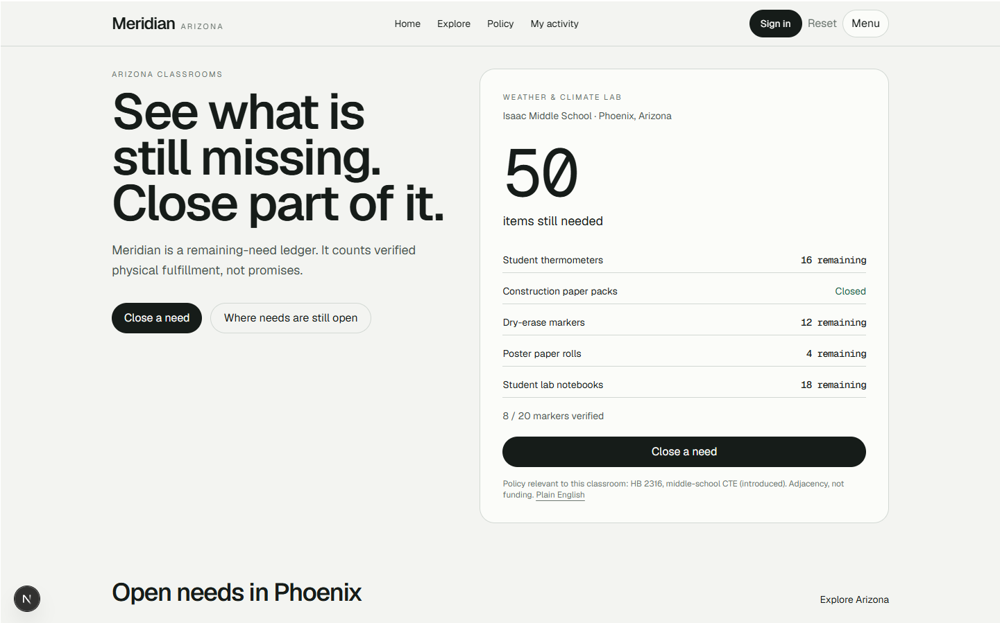
</p>

<p align="center"><em>The remaining-need ledger is the homepage's primary object. Instead of a fundraising target, Meridian surfaces the exact items still missing from a classroom.</em></p>

---

> **Meridian makes classroom needs measurable at the item level. Instead of asking whether a project is funded, Meridian shows exactly what is verified, what is pending, and what is still missing.**

Meridian is an Arizona classroom remaining-need ledger that makes the exact physical items still needed visible, lets communities fulfill those items through verified shipping or in-person handoffs, and connects classroom needs with relevant Arizona education policy.

## Contents

- [What is Meridian?](#what-is-meridian)
- [The problem](#the-problem)
- [The core mechanism](#the-core-mechanism)
- [Not another classroom fundraiser](#not-another-classroom-fundraiser)
- [How fulfillment works](#how-fulfillment-works)
- [Product tour](#product-tour)
- [Arizona policy](#arizona-policy)
- [Architecture](#architecture)
- [Built at Code Arizona](#built-at-code-arizona)
- [The 90-second story](#the-90-second-story)
- [Getting started](#getting-started)
- [Documentation](#documentation)
- [Limitations and next](#limitations-and-next)
- [Sources](#sources)

---

## What is Meridian?

Meridian treats **remaining need** as the public object.

A classroom is not "70% funded." It is:

| Item | Verified | Still needed |
| ---: | ---: | ---: |
| Dry-erase markers | **8 / 20** | 12 |
| Construction paper packs | **10 / 10** | closed |
| Student thermometers | **4 / 20** | 16 |
| Poster paper rolls | **1 / 5** | 4 |
| Student lab notebooks | **12 / 30** | 18 |

Closed paper does not close unfinished markers. Mixed lists stay open until every line is verified closed.

The public count does **not** move because someone promised to help. It moves when a teacher verifies a shipment or confirms an in-person handoff.

```text
  8 / 20 verified
      + 5 submitted (pending)
  still 8 / 20 on the public ledger
      teacher verifies
  13 / 20 verified
   7 still needed
```

---

## The problem

Traditional classroom funding experiences often reduce the situation to:

> How much money has this project raised?

That can hide the physical reality:

> Which exact items are still missing?

Partial gifts, unfinished lists, and unverified clicks all look like progress on a single percentage bar. Teachers still know which line is empty. Neighbors cannot see it.

Meridian changes the unit of measurement from campaign progress to **item remainder**, then requires **confirmation before that remainder decreases**.

### Why item-level visibility matters

- A neighbor can close **part** of a line (5 of 12 remaining markers) without pretending the whole request is done.
- Teachers see what is still open after mixed fulfillment.
- Shipping evidence and in-person confirmation separate intent from arrival.
- Policy pages sit beside the classroom as context, not as a second product.

No impact statistics are claimed here. The mechanism is the argument.

---

## The core mechanism

# The Meridian loop

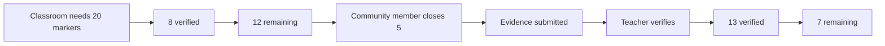

Only **verified** fulfillment changes the public count. Pending shipments and unconfirmed handoffs stay visible as pending.

---

## Not another classroom fundraiser

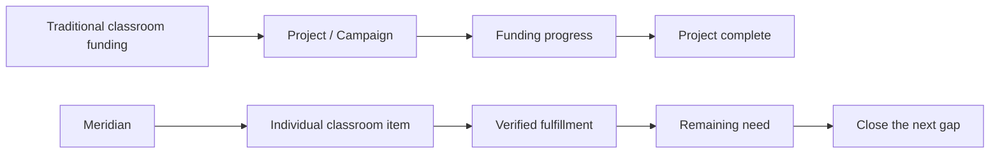

DonorsChoose and similar platforms organize around classroom projects and funding goals. Amazon wishlists organize around purchase links. Meridian organizes around the individual physical items remaining inside the classroom, then counts them only after verification.

This is a category distinction, not a ranking of other products.

| | Classroom fundraiser | Purchase wishlist | Meridian |
| --- | --- | --- | --- |
| Teacher needs | Yes | Yes | Yes |
| Item-level remainder | Often secondary to a funding goal | List-based | **Core object** |
| Partial close of one line | Variable | Manual | **Native** |
| Count only after confirmation | Variable | Typically no | **Required** |
| Campus map | Sometimes | No | **Yes** |
| Arizona policy beside the need | Typically no | No | **Yes** |

---

## How fulfillment works

Two paths. Same ledger. Different confirmation.

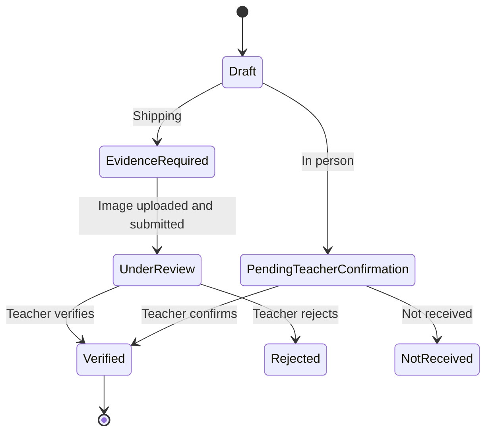

### Shipping

1. Choose item and quantity.
2. Choose **Ship it**.
3. Review campus destination (school campus, never a home address).
4. Upload a photo of the shipping label or order confirmation. Submit is disabled until a file is selected.
5. Status becomes **Under review**. Public verified count does not change.
6. The teacher reviews the photo and taps **Verify fulfillment** or **Reject**.

### In person

1. Choose item and quantity.
2. Choose **In person**.
3. Submit the intended handoff. No photo is required.
4. Status becomes **Awaiting teacher confirmation**.
5. The teacher taps **Confirm received** (with a second confirmation) or **Not received**.

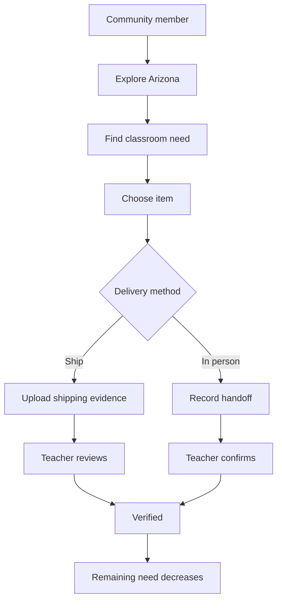

Roles in the current build:

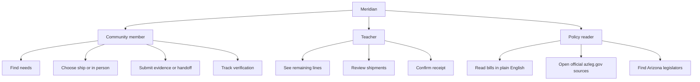

Teachers can also create an account. New teacher accounts do not inherit Maria Hernandez's seeded classroom unless they are the seeded teacher account.

---

## Product tour

Screenshots below are the intended captures. Files live in [`docs/assets/`](docs/assets/README.md). If an image is not in the repo yet, GitHub will show the alt text until the file is added. 
#### DISCLAIMER: The names used in the demo are fictional and made up. 

<div align="center">

| Homepage | Remaining-need ledger |
| --- | --- |
| 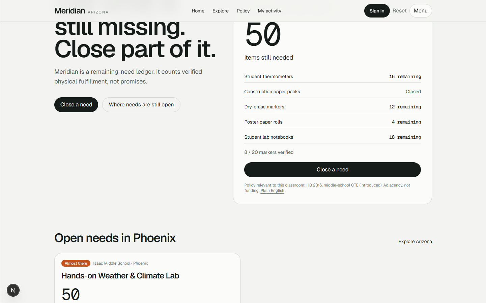 | 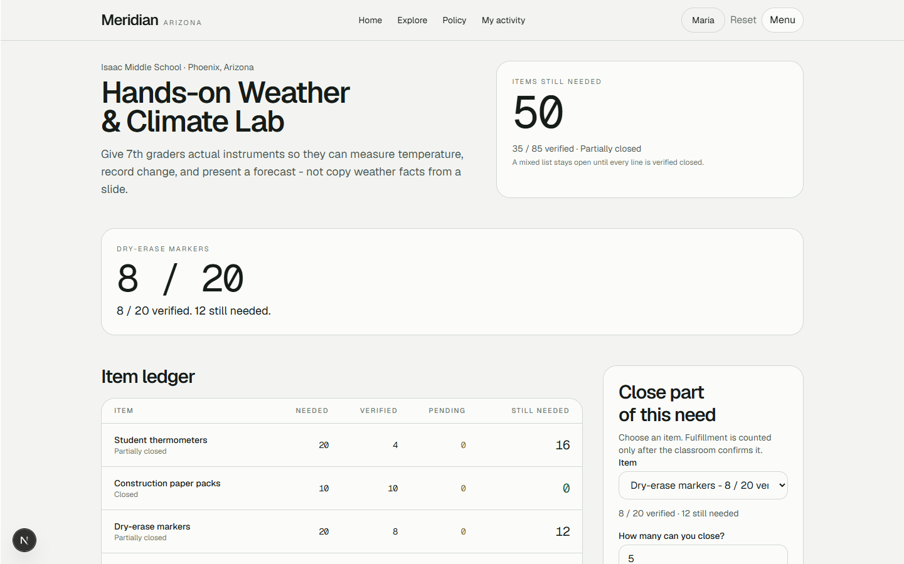 |

<p><em><strong>Homepage.</strong> Remaining need first, then classroom context, then a close action.</em></p>
<p><em><strong>Ledger.</strong> Needed, verified, pending, and still needed on one table. Mixed lists stay open.</em></p>

| Shipping evidence | Teacher verification |
| --- | --- |
| 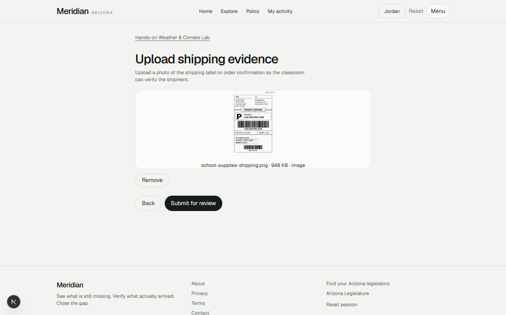 | 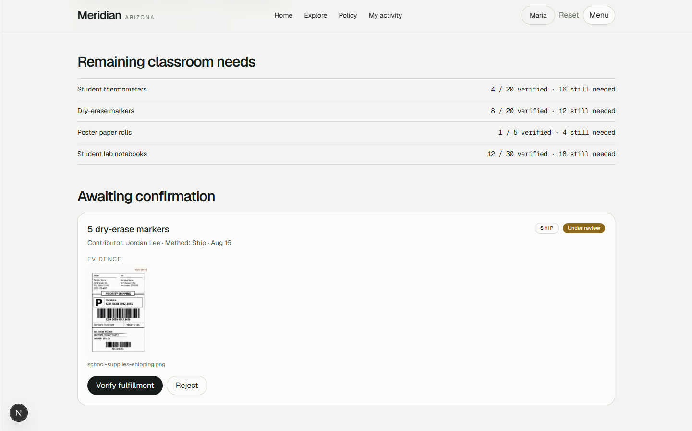 |

<p><em><strong>Shipping.</strong> Upload is required. Under review does not appear until submit.</em></p>
<p><em><strong>Teacher desk.</strong> Pending quantity, method (Ship or In person), evidence, then verify or reject.</em></p>

| Arizona map | Policy relevant to this classroom |
| --- | --- |
| 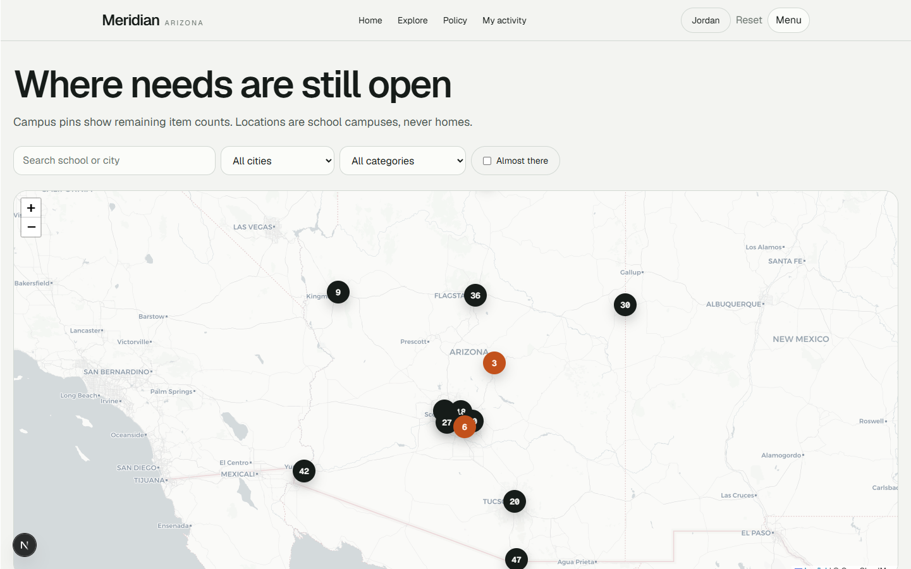 | 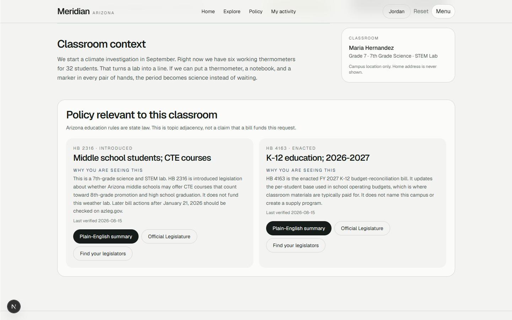 |

<p><em><strong>Map.</strong> Pins are remaining item counts at public campuses, statewide, never homes.</em></p>
<p><em><strong>Policy.</strong> Topic overlap with official sources. Not a claim that a bill funds this classroom.</em></p>

</div>

---

## Arizona policy

Navigation label: **Policy**.

Bill pages use official Arizona Legislature text, overviews, and dated **last verified** fields (this build: August 15, 2026). Civic buttons open [azleg.gov](https://www.azleg.gov/) and [Find your legislators](https://www.azleg.gov/findmylegislator/).

On a classroom page, related bills appear as **Policy relevant to this classroom**, with a plain-English "why you are seeing this" note. That is adjacency (subject overlap), not funding.

Meridian does not send messages, endorse bills, or tell anyone how to vote.

---

## Architecture

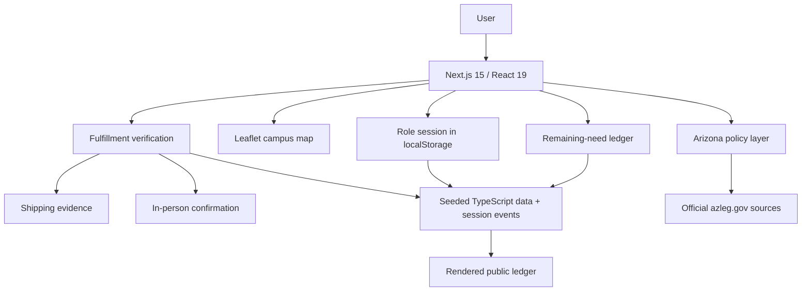

| Layer | Technology | Purpose |
| --- | --- | --- |
| App | Next.js 15 (App Router) + React 19 | Routes and UI |
| Language | TypeScript | Types for ledger, roles, bills |
| Styling | Tailwind CSS v4 + CSS tokens | One visual system |
| Map | Leaflet + react-leaflet | Campus pins, remaining counts |
| State | React context + `localStorage` key `meridian-session-v4` | Deterministic session, reset |
| Data | Seeded modules in `src/data/` | Classrooms, schools, bills |
| Policy | Curated records + official URLs | Last-verified legislative pages |

There is no payment processor, carrier API, OCR, or live bill scraper in this repository.

### Why we built it this way

- **Item-level state** because a classroom can have some supplies fulfilled and others missing.
- **Verification** because a promise is not arrival.
- **Campus geography** because neighbors need local discovery without teacher home addresses.
- **Policy adjacency** because the same classroom sits inside Arizona education law.
- **Seeded, local state** because a 10-hour Code Arizona build had to prove the mechanism, not operate a production backend.

---

## Built at Code Arizona

> Meridian was built during **Code Arizona**, a 10-hour Arizona coding competition for high-school hackers, held August 15, 2026 at BASIS Chandler.
>
> This is **Code Arizona** ([codeaz.codehatch.org](https://codeaz.codehatch.org/)), not Hack Arizona, which is a separate University of Arizona event.
>
> We built the project against a field of **31 teams** and presented it to judges including Michael Gibson (Co-founder, 1517 Fund), Pavan Turaga (Founding Director, ASU GAME School), Cameron Sechrist (Head of Engineering, Stax.ai), and Ashley Woodburn (Program Manager, Aspiring Youth Academy).

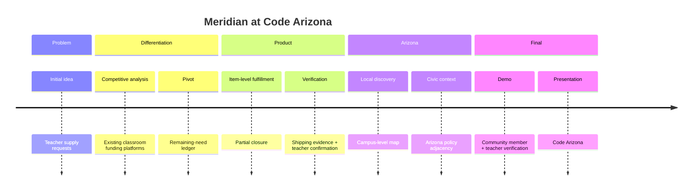

### The room we built for

The project was presented to the four judges named above. We do not claim what any judge personally valued.

What a technically careful reader can evaluate:

| Mechanism | What to look at |
| --- | --- |
| Product | Item-level remaining need, mixed lists stay open |
| Trust | Pending does not increment verified |
| Geography | Campus pins, no home addresses |
| Civic | Official bill sources, last verified, no endorsement |

Full story: [`docs/hackathon.md`](docs/hackathon.md). Exact clicks: [`docs/demo.md`](docs/demo.md).

---

## The 90-second story

1. Community member signs in as Jordan Lee.
2. After Reset, Activity has no pending events.
3. Explore filters to Isaac Middle School, Phoenix.
4. **Hands-on Weather & Climate Lab** shows mixed lines: paper closed, markers **8 / 20**, thermometers still open.
5. Jordan chooses dry-erase markers, quantity **5**.
6. Chooses **Ship it**.
7. Uploads a shipping-label photo. Submit for review becomes available only after a file is selected.
8. The contribution is **Under review**. The public ledger still reads **8 / 20**.
9. Jordan records an in-person handoff for student lab notebooks. No photo. Status: awaiting teacher confirmation.
10. Maria Hernandez opens Activity and sees both pending items.
11. She verifies the shipment (evidence visible) and confirms the in-person receipt.
12. Markers become **13 / 20**. **7 still needed.** Mixed list stays open.

Pending never impersonates verified. That is the product.

---

## Getting started

Requires Node.js 18+.

```bash
npm install
npm run dev
```

Open [http://localhost:3000](http://localhost:3000).

No `.env` file is required. There is no map API key.

### Seeded sign-in

On `/signin`, use **Continue with an existing account** (buttons show **Jordan Lee** / Community member and **Maria Hernandez** / Teacher), or email and password:

| Role | Name | Email | Password |
| --- | --- | --- | --- |
| Community | Jordan Lee | `jordan.lee@phoenix.az` | `meridian` |
| Teacher | Maria Hernandez | `maria.hernandez@isaacms.az` | `meridian` |

These are in-app seeded accounts for the local session. They are not real school-district logins.

### Deterministic presentation state

1. Click **Reset** in the desktop header (or **Reset session** in the footer, mobile menu, or account page).
2. Weather lab dry-erase markers return to **8 / 20 verified**, with **no pending** session events.
3. Construction paper stays closed at **10 / 10**. Notebooks start at **12 / 30**. Thermometers start at **4 / 20**.

Reset clears fulfillment events, evidence, and review state. It keeps the signed-in user so you can repeat the flow.

Session storage key: `meridian-session-v4`.

---

## Documentation

| Doc | What it covers |
| --- | --- |
| [docs/README.md](docs/README.md) | Index |
| [docs/product.md](docs/product.md) | Thesis, users, journeys |
| [docs/fulfillment.md](docs/fulfillment.md) | Ledger math and state machine |
| [docs/architecture.md](docs/architecture.md) | Routes, components, state |
| [docs/policy.md](docs/policy.md) | Adjacency, sources, neutrality |
| [docs/design-system.md](docs/design-system.md) | Tokens, type, hierarchy |
| [docs/demo.md](docs/demo.md) | Exact live walkthrough |
| [docs/hackathon.md](docs/hackathon.md) | Code Arizona story |
| [docs/decisions.md](docs/decisions.md) | Why these choices |
| [docs/security-and-privacy.md](docs/security-and-privacy.md) | Campus-only, no student PII |
| [docs/contributing.md](docs/contributing.md) | Local development |
| [docs/assets/README.md](docs/assets/README.md) | Screenshot manifest |

Repository layout (application code lives under `src/`):

```text
CA/
├── src/
│   ├── app/                 # Next.js App Router pages
│   ├── components/          # Ledger, map, nav, upload, policy, cards
│   ├── data/                # Seeded schools, teachers, requests, bills, accounts
│   └── lib/                 # store, fulfillment, catalog, policyRelevance, format, types
├── docs/
│   ├── architecture.md
│   ├── product.md
│   ├── fulfillment.md
│   ├── policy.md
│   ├── design-system.md
│   ├── demo.md
│   ├── decisions.md
│   ├── hackathon.md
│   ├── security-and-privacy.md
│   ├── contributing.md
│   └── assets/              # Screenshot placeholders until files are added
├── README.md
├── PRODUCT.md
└── package.json
```

---

## Limitations and next

The hackathon implementation focuses on proving the product mechanism and user experience. Production deployment would require additional infrastructure: school identity verification, durable storage, real logistics, notifications, and a live legislative ingest.

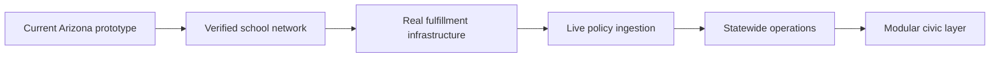

**Now:** ledger, verification, map, policy adjacency.  
**Next:** institutional verification, storage, notifications, logistics.  
**Later:** broader civic modules, only after the Arizona mechanism is real.

This repository does not currently include a license file.

---

## Sources

- [Code Arizona](https://codeaz.codehatch.org/) - event format, high-school audience, August 15, 2026 BASIS Chandler listing
- [Arizona Legislature](https://www.azleg.gov/) - official bill text and member tools
- [Find your Arizona legislators](https://www.azleg.gov/findmylegislator/)
- [Arizona Department of Education](https://www.azed.gov/)

Bill pages in the app also cite the specific official URL on each record.
