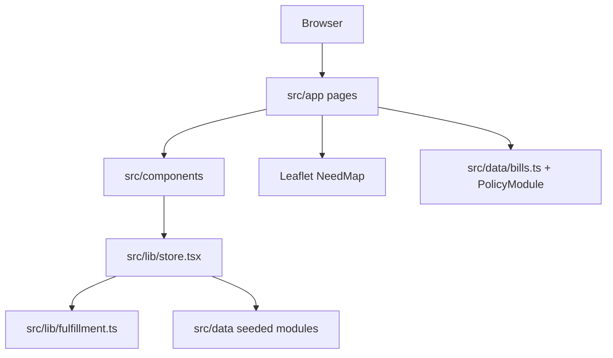

# Architecture

Meridian is a Next.js 15 App Router application. Application code is under `src/`. There is no separate backend process.

## Routes

| Path | Page |
| --- | --- |
| `/` | Homepage remaining-need hero |
| `/explore` | Arizona map + filtered request cards |
| `/requests` | Open remaining needs |
| `/requests/[id]` | Ledger, close panel, policy module |
| `/requests/[id]/fulfill` | Ship vs in-person wizard |
| `/bills` | Policy index |
| `/bills/[id]` | Bill detail + official links |
| `/teachers/[id]` | Classroom profile + wishlist |
| `/signin`, `/signup`, `/account` | Auth UI |
| `/activity` | Teacher desk or community activity |
| `/dashboard` | Redirects to `/activity` |
| `/about`, `/privacy`, `/terms`, `/contact` | Footer pages |
| `/trust` | Redirects to `/about` |

## Components

| File | Role |
| --- | --- |
| `Nav.tsx` | Sticky header, desktop links, mobile overlay menu |
| `ClosePanel.tsx` | Item + quantity, then continue into fulfill |
| `ItemLedger.tsx` | Table and remaining-need numeral |
| `ShippingUpload.tsx` | Drag/drop, preview, validation |
| `NeedMap.tsx` / `NeedMapClient.tsx` | Leaflet pins as remaining counts |
| `PolicyModule.tsx` | Adjacency copy + official links |
| `WishlistPanel.tsx` | Longer-horizon items + shipment submit |
| `RequestCard.tsx` | Explore / list cards |
| `CivicAction.tsx` | Official legislator links |
| `ArizonaSilhouette.tsx` | Arizona outline graphic |
| `Providers.tsx` | App store wrapper |
| `ui.tsx` | Badges, status chips, empty states |

## State

`useApp()` in `src/lib/store.tsx` holds:

- seeded + signed-up `accounts`
- `sessionUserId`
- `events` (fulfillment records)
- `lastAction` / notice for teacher verify toasts

Persisted as JSON in `localStorage` under `meridian-session-v4`.

Reset copies initial events (empty) while keeping the current user and any extra signed-up accounts.

## Seeded data

| Module | Contents |
| --- | --- |
| `src/data/schools.ts` | 14 public campus locations |
| `src/data/teachers.ts` | Seeded educators tied to campuses |
| `src/data/requests.ts` | Classroom requests and item lines |
| `src/data/wishlists.ts` | Optional longer-horizon lists |
| `src/data/bills.ts` | Curated AZ bills + `civicLinks` |
| `src/data/accounts.ts` | Jordan, Maria, staff |

`src/lib/catalog.ts` hydrates a request with live items and totals. `src/lib/policyRelevance.ts` supplies the "why you are seeing this" adjacency copy. `src/lib/format.ts` formats dates and bill-status labels.

## Map

Leaflet tiles (Carto light). Pins are remaining counts. Popup: school, city, remaining, top open lines, close link. Map wrapper uses `isolation: isolate` so tiles do not stack over the header.

## Auth model

Client-side email/password against seeded and locally created accounts. Roles: `community`, `teacher`, `admin`. Any signed-in user can submit ship or in-person fulfillment. Only the teacher whose `teacherId` matches the event (or the staff admin) can verify, reject, or confirm it. New teacher sign-ups do not receive a `teacherId`, so they cannot review Maria Hernandez's seeded classroom. This is session UX, not production identity.

## Stack truth

Used: Next.js 15, React 19, TypeScript, Tailwind CSS v4, Leaflet, react-leaflet.  
`lucide-react` is listed in `package.json` and is not imported in `src/`.  
There is no `public/` asset folder in this repository. Screenshots belong in `docs/assets/`.  
No environment variables. No license file.
