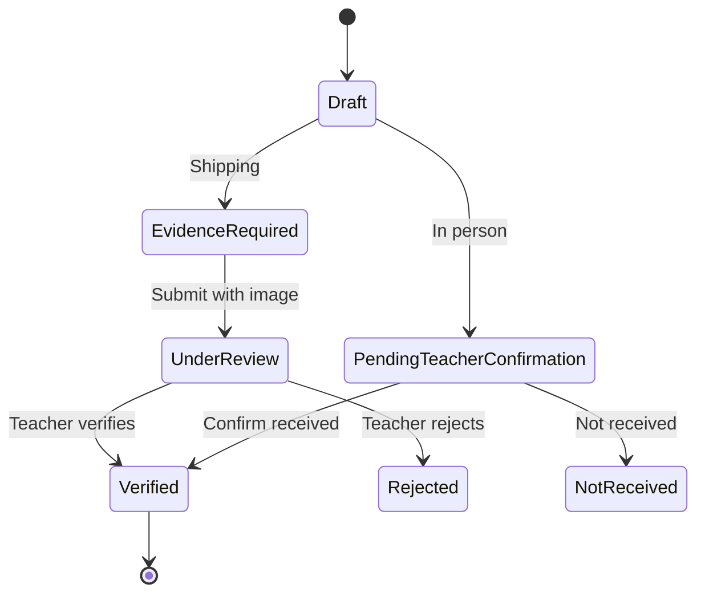

# Fulfillment

Public ledger rule: **only `verified` events add to the fulfilled count.**

Pending statuses (`under_review`, `pending_teacher_confirmation`) display as pending. They do not increase `verified`.

## Item math

For each line:

```text
verified  = seedFulfilled + sum(session events with status verified)
pending   = sum(session events in under_review or pending_teacher_confirmation)
remaining = needed - verified
remainingAfterPending = remaining - pending
```

Excess quantity is rejected (`Only N remain.`). The UI does not silently clamp a 12 into a 5 without telling the user.

Example, dry-erase markers on the Weather & Climate Lab:

| Moment | Verified | Pending | Public remaining |
| --- | --- | --- | --- |
| Reset | 8 / 20 | 0 | 12 |
| Jordan submits 5 (ship) | 8 / 20 | 5 | 12 (7 would remain once verified) |
| Maria verifies | 13 / 20 | 0 | 7 |

Construction paper starts closed at 10 / 10. That does not close markers.

## Channels

| Channel | Evidence | Pending label | Teacher action |
| --- | --- | --- | --- |
| `ship` | Required image (JPG, PNG, WEBP) | Under review | Verify fulfillment / Reject |
| `in_person` | None required | Awaiting teacher confirmation | Confirm received / Not received |
| `wishlist_shipment` | Same upload pattern on teacher wishlist | Under review | Same as ship |



Shipping submit is disabled until a file is selected. In-person submit does not ask for a photo.

Rejected and not-received events stay in history. They do not increment verified.

## Where this lives in code

- Types: `src/lib/types.ts` (`FulfillmentStatus`, `FulfillmentChannel`, `LiveFulfillment`)
- Math: `src/lib/fulfillment.ts` (`liveItems`, `clampGift`, `isPending`)
- Session: `src/lib/store.tsx` (`submitShipment`, `submitInPerson`, `reviewEvent`, `resetSession`)
- UI: `src/app/requests/[id]/fulfill/page.tsx`, `src/components/ShippingUpload.tsx`, `src/app/activity/page.tsx`

Evidence is stored in the browser session as metadata plus a resized JPEG data URL for preview. There is no object store and no OCR.
