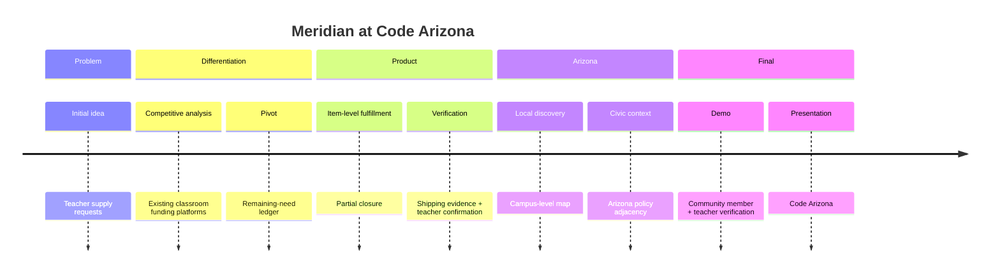

# Hackathon

Meridian was built at **Code Arizona**, not Hack Arizona.

Hack Arizona is a separate University of Arizona event. This repository is from Code Arizona.

## Event

**Code Arizona**  
Arizona's premier coding competition for high-schoolers.

Official site: https://codeaz.codehatch.org/

The official site describes a ten-hour coding event for high-school hackers across Arizona, with workshops, mentors, food, and project building.

## Date

August 15, 2026

## Location

BASIS Chandler

## Format

10-hour high-school coding competition.

## Competition size

31 teams

## Judges

Use these names and positions only. Do not invent biography. Do not claim what any judge personally valued.

| Judge | Position |
| --- | --- |
| Michael Gibson | Co-founder, 1517 Fund |
| Pavan Turaga | Founding Director, ASU GAME School |
| Cameron Sechrist | Head of Engineering, Stax.ai |
| Ashley Woodburn | Program Manager, Aspiring Youth Academy |

Judging criteria beyond this panel were not documented in this repository.

## The original question

Build something that Arizonians Want

## The initial problem with the idea

A conventional teacher-supply marketplace already exists. Building another list of things to buy would not explain why this should exist in Arizona, in a day, against 31 other teams.

## The strategic pivot

Instead of tracking fundraising goals, Meridian tracks the exact physical items still missing. The classroom is not "70% funded." It is 8 / 20 markers, 10 / 10 construction paper, 4 / 20 thermometers.

## The mechanism

The remaining-need ledger. Mixed lists stay open. Closed lines stay closed. Remaining lines stay countable.

## The second insight

A contribution should not count merely because someone says they contributed.

## The trust system

Shipping: upload evidence, teacher verifies.  
In person: record a handoff, teacher confirms receipt.  
Only then does the public count move.

## The Arizona layer

Campus-level local discovery on a statewide map, plus education policy shown as adjacency with official Legislature sources.

## The final product

An end-to-end system where a user can:

See remaining need → Choose an item → Provide evidence or record a handoff → Teacher verifies → Close part of the gap.

Timestamps inside the day are not recorded here. The sequence is the product story, not a minute-by-minute log.

## The room we built for

The project was presented to Michael Gibson, Pavan Turaga, Cameron Sechrist, and Ashley Woodburn.

What a technically sophisticated judge can inspect:

### Product mechanism

Item-level state. Verified, pending, remaining, per line.

### Trust mechanism

Verified fulfillment. Evidence for shipping. Confirmation for in-person.

### Geographic mechanism

Campus-level Arizona discovery across seeded cities, not a Phoenix-only pin.

### Civic mechanism

Policy adjacency with official sources and an explicit non-funding disclaimer.

None of the above is a claim that a particular judge praised or criticized the project.
