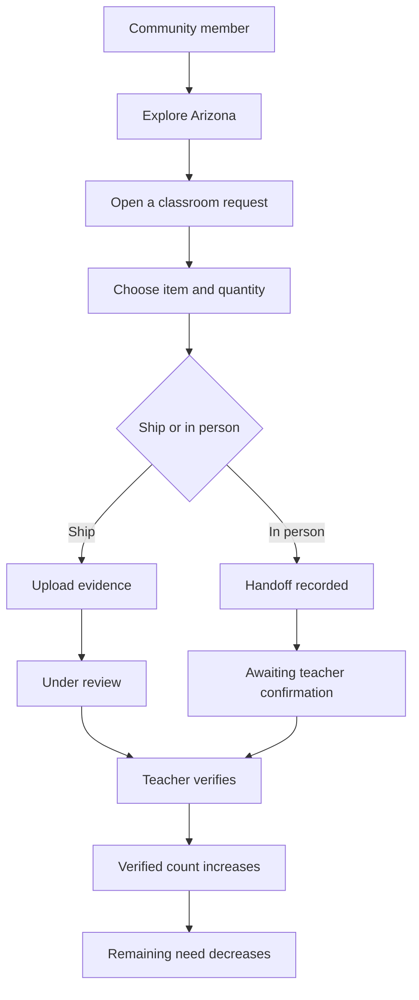

# Product

Meridian is an Arizona classroom remaining-need ledger. It shows the exact physical items still missing, lets a community member close part of a line through shipping or an in-person handoff, and counts that close only after the teacher verifies arrival. Relevant Arizona education bills sit beside the classroom as topic adjacency, with official Legislature links.

This is not a fundraising thermometer. It is not DonorsChoose for Arizona. It is not Hack Arizona.

## Problem

Campaign-style classroom funding answers "how funded is this project?" That hides unfinished lines. A mixed kit can look mostly done while markers are still short.

Meridian answers "what is still missing?" at item granularity, then "what has actually arrived?"

## Thesis

See remaining need. Choose how to close part of it. Verify arrival. The public number moves only then.

## Who it is for

| Role in this build | What they can do |
| --- | --- |
| Community member | Browse needs, submit ship or in-person fulfillment, watch pending vs verified |
| Teacher | Review shipments, confirm or reject in-person handoffs, see remaining lines |
| Anyone | Read Policy pages and official azleg.gov sources without an account |

Seeded walkthrough accounts: Jordan Lee (community) and Maria Hernandez (teacher at Isaac Middle School, Phoenix). Sign-in offers one-click buttons for those two names. Classroom records are seeded product data. School names and coordinates are public campuses, not partnerships. The featured request is **Hands-on Weather & Climate Lab**.

## Core objects

- **Request:** a classroom need with multiple item lines
- **Item:** `quantityNeeded`, seeded verified baseline, live pending and remaining
- **Fulfillment event:** quantity + channel (`ship` or `in_person`) + status
- **Bill:** official number, status, last verified date, official URL

## Journeys

A policy reader can skip fulfillment entirely: open **Policy**, read plain English, follow the official bill link.

## Differentiation

DonorsChoose organizes around projects and dollars. Wishlists organize around purchase links. Government sites publish statutes. Meridian is one Arizona-facing system where outstanding physical need, campus discovery, and civic literacy share a ledger.

## Future direction

Keep the mechanism. Add real school identity, durable storage, and logistics only after the remaining-need plus verification loop is the product people remember. See [decisions.md](decisions.md) and the README roadmap.
